

# Świat Główny

> Główny świat serwera został przebudowany. Ponad 
100 nowych biomów, nowe struktury i dungeony.

### Generator teranu

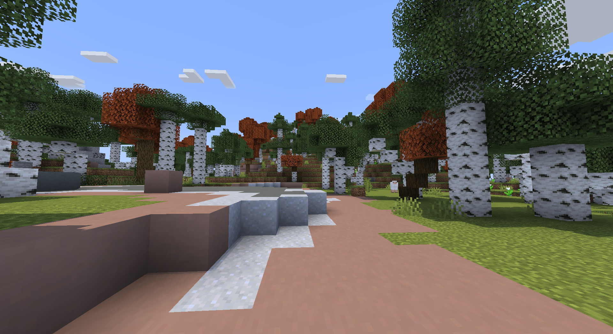

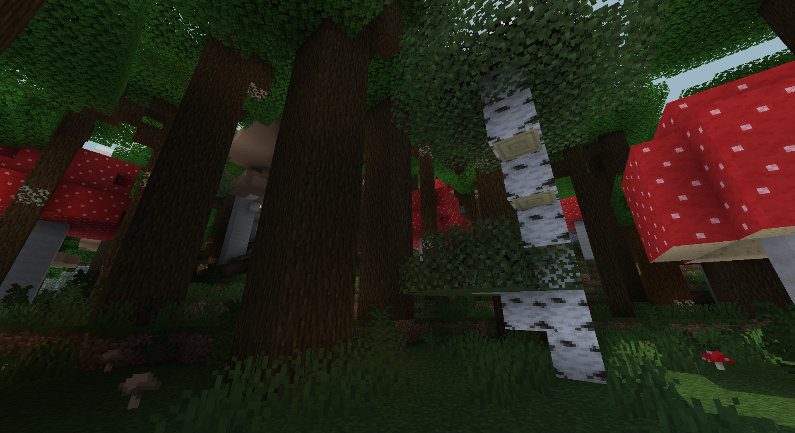

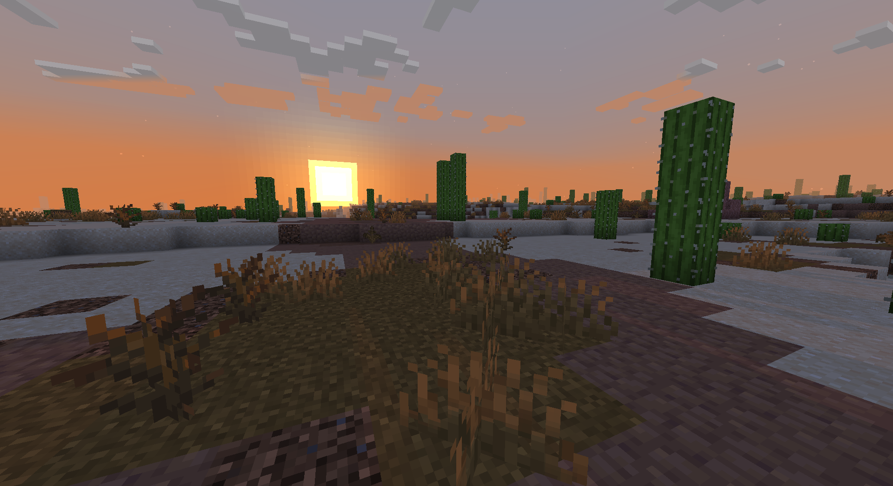

[pełna lista biomów](/biomes)

### Struktury

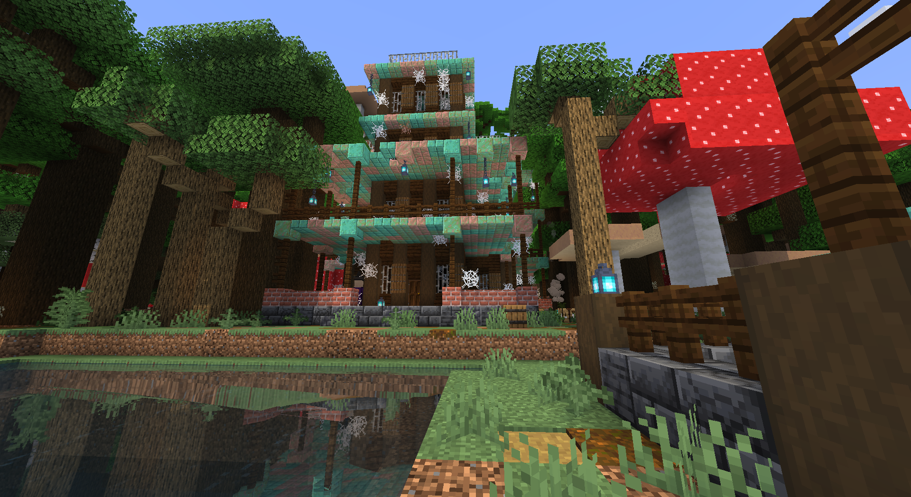

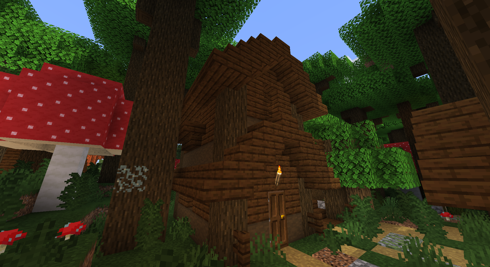

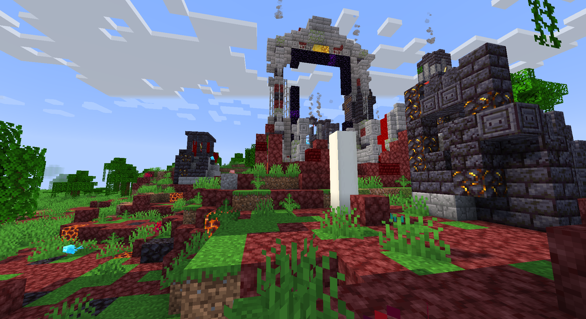

# Nether

> Istniejące biomy zostały ulepszone, na tym świecie zostały dodane nowe dangeony i struktury.

### Generator teranu

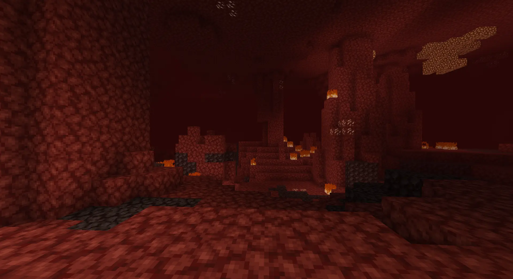

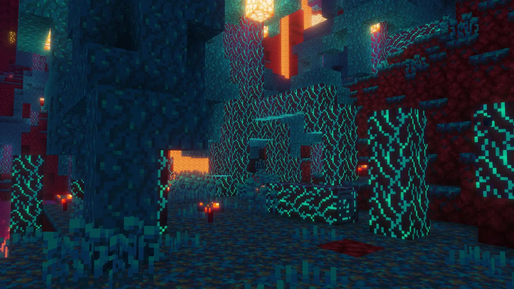

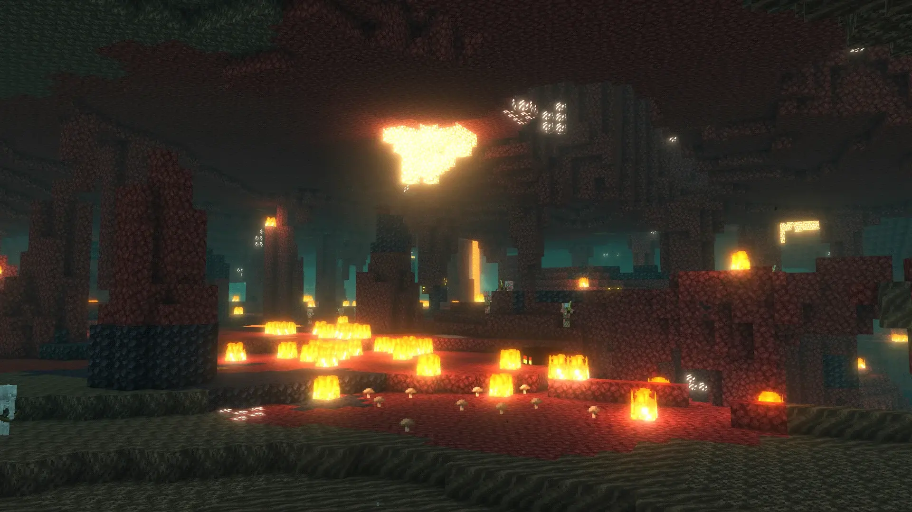

### Struktury

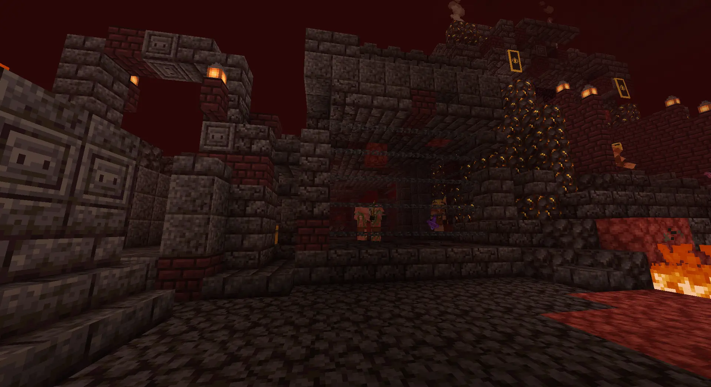

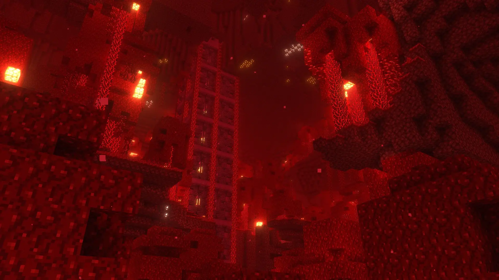