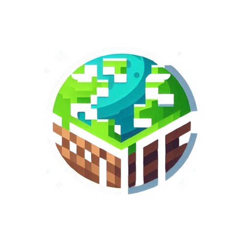

Wikipedia powstała, aby ułatwić nowym graczom rozpoczęcie swojej przygody na serwerze  Na naszym serwerze znajdziesz wiele innowacyjnych mechanik, które zostały starannie zaprojektowane, aby idealnie wpasować się w świat minecrafta.  Miłej zabawy!

### Zawartość
- 🗺️ [Generator](/generator) - Nowy generator terenu i struktury.
- 🏜️ [Biomy](/biomes) - Lista wszystkich biomów dostępnych na serwerze.
- 🧭 [Lokalizacja i czas](/location) - Zmieniona mechanika koordynatów.
- 🏺 [Przedmioty](/items) - Lista wszystkich zmian dotyczących przedmiotów.
- 🗿 [Mini bloczki](/miniblocks) - Nowe małe bloczki.
- 🔍 [Rozmiar postaci](/playersize) - Mechanika zmiany wielkości postaci.
- 📜 [Enchanty](/enchants) - Lista nowych enchantów dostępnych na serwerze.
- ⛏️ [Jedwabny dotyk](/silktouch) - Ulepszona mechanika jedwabnego dotyku.
- 🏕️ [Ogniska](/campfire) - Nowa mechanika ognisk.
- 🪓 [Wycinka drzew](/treecut) - Nowa mechanika ścinania drzew.