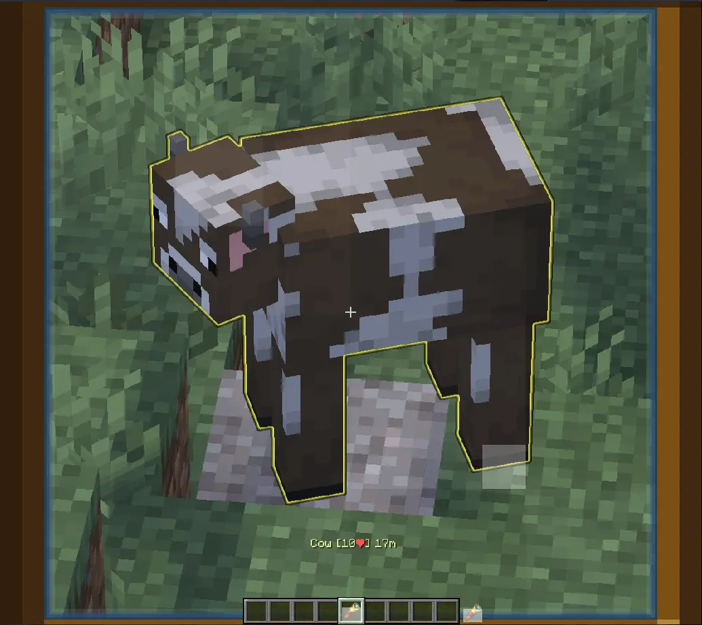
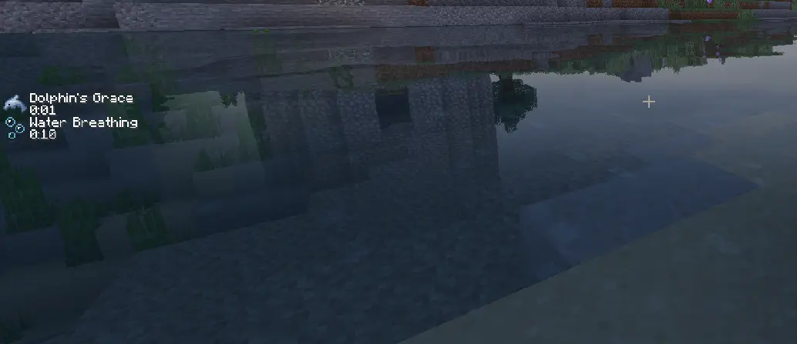
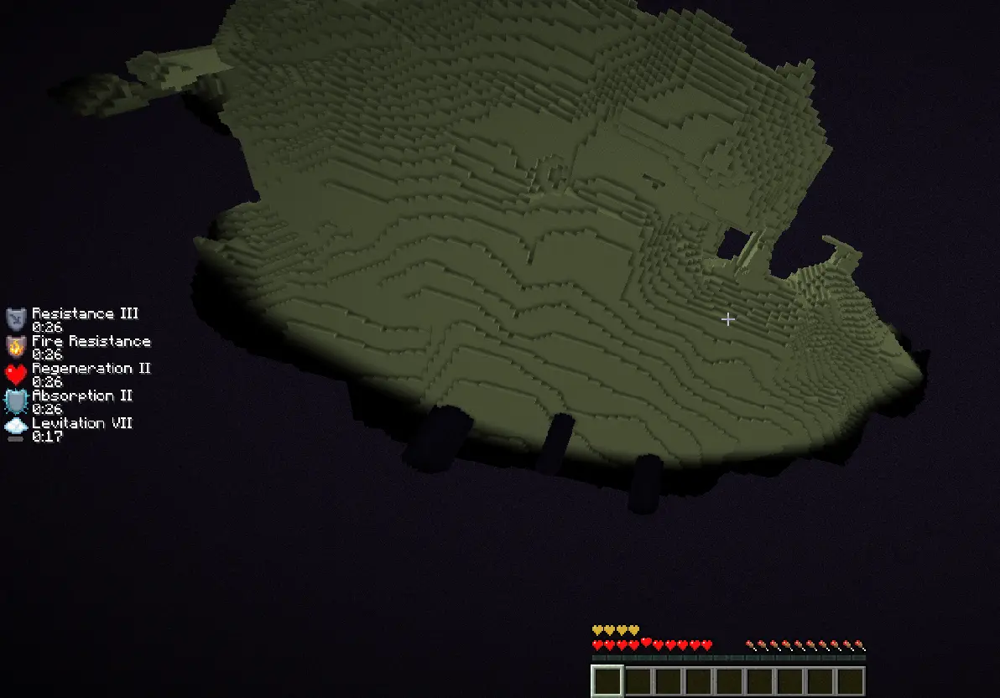
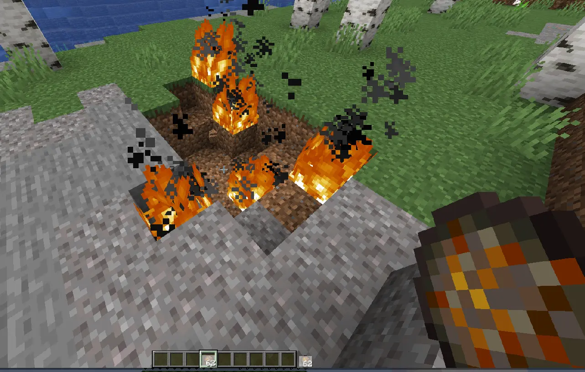

# Przedmioty

> Na serwerze dodano i zmieniono funkcjonalności niektórych przedmiotów. Poniżej znajdziesz opis tych przedmiotów.

## Luneta

> Dzięki lunecie możesz oznaczyć moby lub graczy na 30 sekund.

## Hełm żółwia

> Hełm od teraz nadaje efekt łaska delfina gdy jesteś w wodzie.   Uwaga! Hełm podczas noszenia zużywa się!

## Totem

> Od teraz totem uratuje Cię od śmierci w nicości! Bardzo przydatne w endzie.

## Kula ognia

> Możesz wypuścić kule ognia  klikając prawym przyciskiem.

