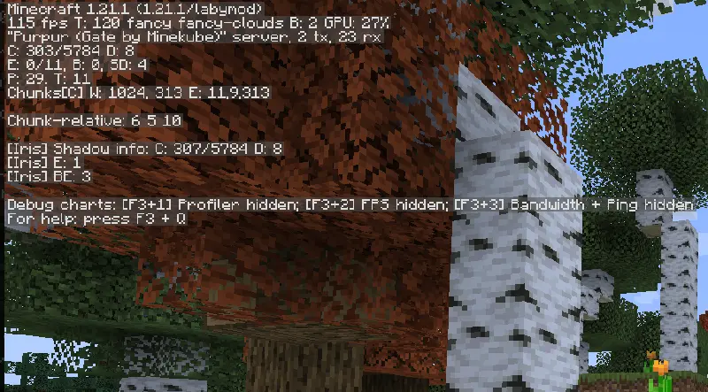
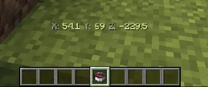
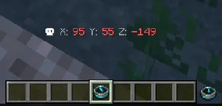
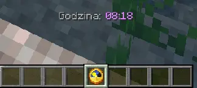

# Lokalizacja i Czas

> Na serwerze informacja lokalizacji (x,y,z) pod F3 została wyłączona.

> Użyj kompasu, aby sprawdzić swoją lokalizację.

> Użyj kompasu powrotnego, aby sprawdzić lokalizację twojej śmierci.

> Użyj zegarka, aby sprawdzić aktualną godzinę na serwerze.

